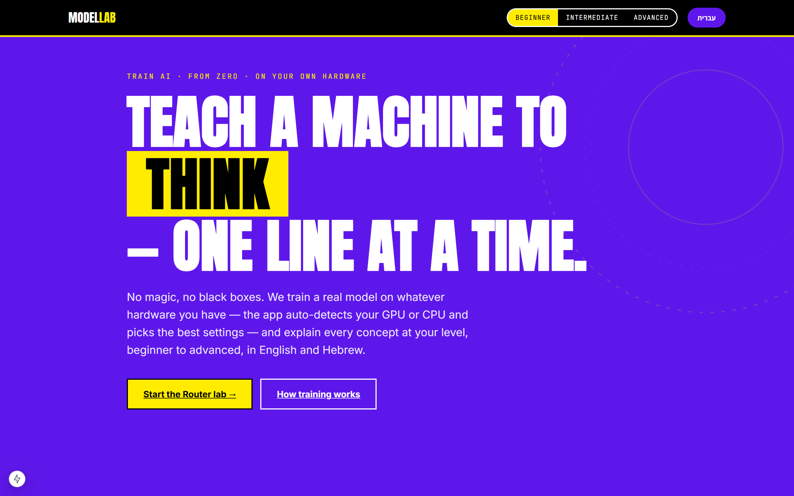
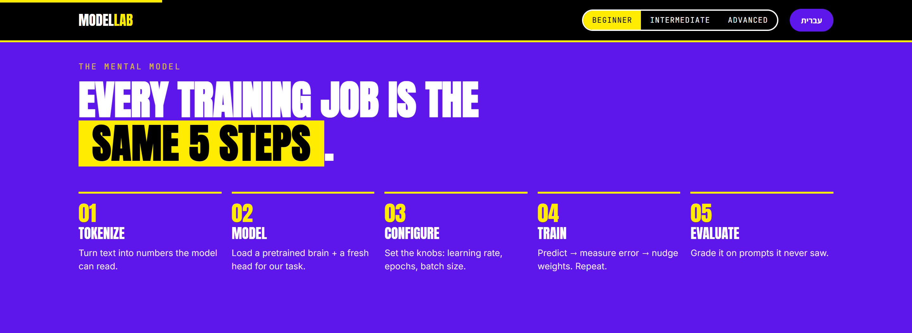
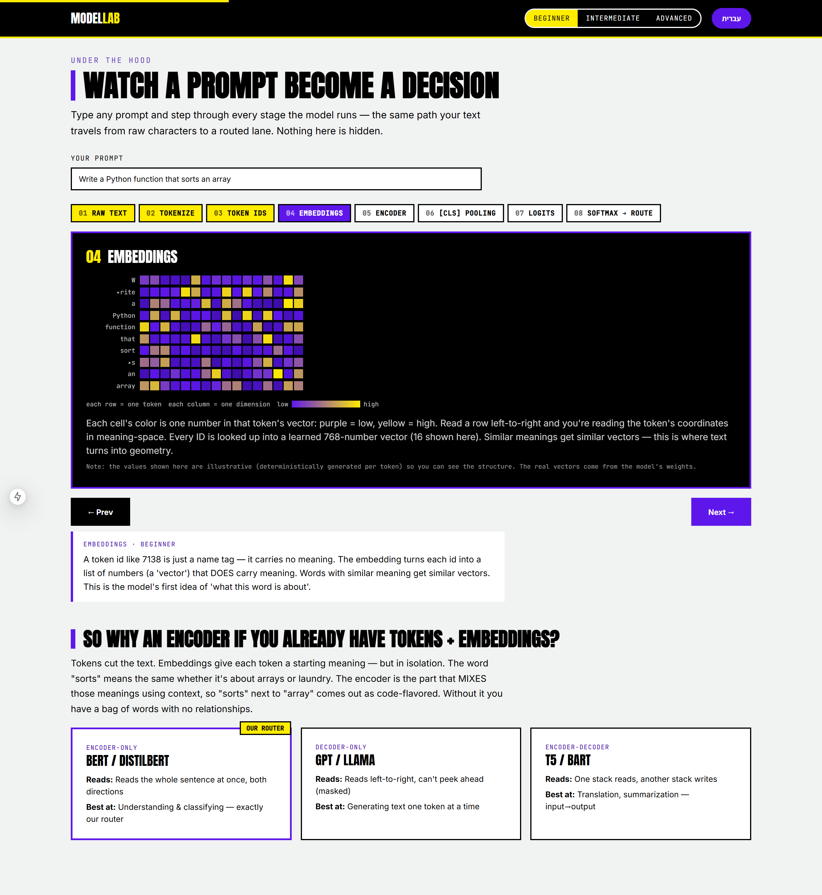
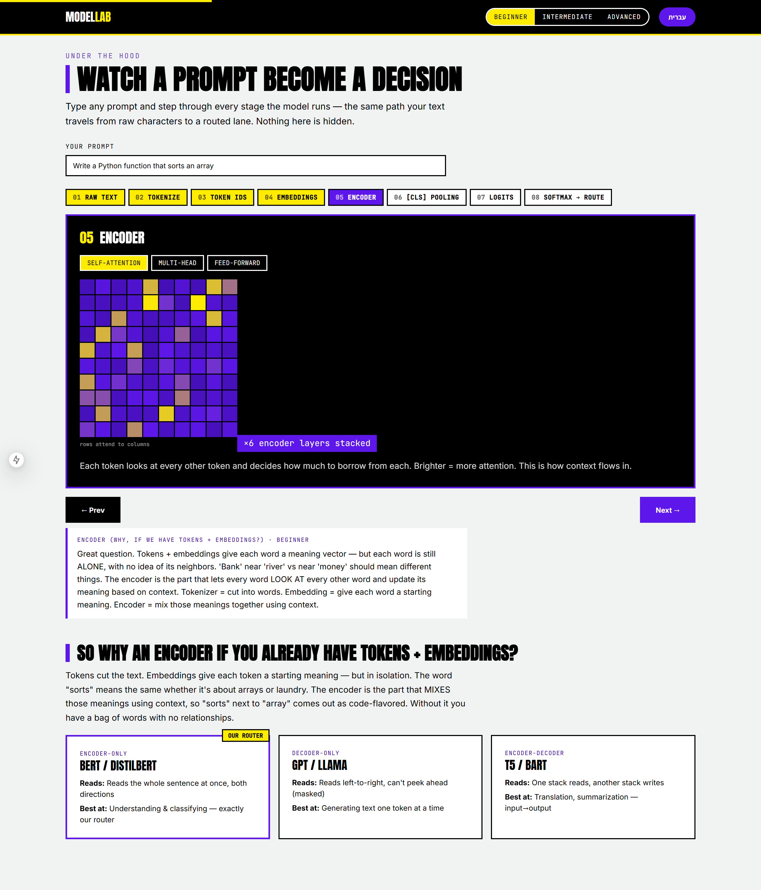
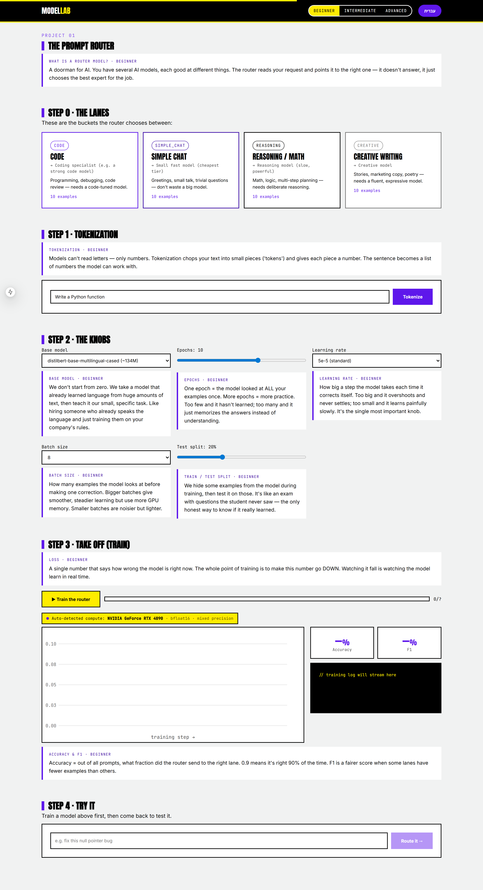

# Model Lab

**Learn how AI models are really trained — from zero, line by line, in English and Hebrew.**

Model Lab is an interactive academy for machine learning. It doesn't *describe* training from a distance — it trains a real model on your own hardware, streams the loss curve live, and explains every concept at three levels (beginner / intermediate / advanced) so nothing stays a black box. Every explanation exists in both English and Hebrew.

The first project is a **prompt router**: a tiny classifier that reads a prompt and decides which kind of model should answer it (code, simple chat, reasoning, or creative). It's the simplest possible "train a real model" task, which is exactly why it's first.



---

## Table of contents

- [What you get](#what-you-get)
- [Quick start](#quick-start)
- [Hardware: zero configuration](#hardware-zero-configuration)
- [The dataset](#the-dataset)
- [The five universal steps of training](#the-five-universal-steps-of-training)
- [Under the hood: how a prompt becomes a decision](#under-the-hood-how-a-prompt-becomes-a-decision)
- [The trainer, explained](#the-trainer-explained)
- [Hyperparameters and *why*](#hyperparameters-and-why)
- [Cleaning and splitting data without contaminating it](#cleaning-and-splitting-data-without-contaminating-it)
- [Watching training work: the loss curve](#watching-training-work-the-loss-curve)
- [Evaluation: which metric, and when](#evaluation-which-metric-and-when)
- [Inference: using the trained model](#inference-using-the-trained-model)
- [Architecture](#architecture)
- [Concepts covered](#concepts-covered)
- [Roadmap](#roadmap)

---

## What you get

- **A real training loop**, not a simulation. HuggingFace `Trainer` fine-tunes `distilbert-base-multilingual-cased` on your machine.
- **Live progress over Server-Sent Events** — watch the loss fall step by step.
- **Three explanation levels** for every concept, toggled in the header.
- **Fully bilingual** (English / Hebrew, with proper RTL).
- **Hardware auto-detection** — runs on NVIDIA GPU, Apple Silicon, or plain CPU with no configuration.
- **An interactive "Under the Hood" pipeline** that walks a prompt through all 8 stages (raw text → tokenize → IDs → embeddings → encoder → pooling → logits → softmax).

---

## Quick start

You need **Python 3.10+** and **Node 18+**.

### 1. Backend (FastAPI)

```bash
cd backend
python -m venv .venv
# Windows:
.venv\Scripts\activate
# macOS / Linux:
source .venv/bin/activate

pip install -r requirements.txt
```

`torch` is intentionally **not** pinned in `requirements.txt`, because the right build depends on your hardware. Install it for your platform:

```bash
# NVIDIA GPU (CUDA 12.1 build):
pip install torch --index-url https://download.pytorch.org/whl/cu121

# CPU-only (any machine, including Apple Silicon for inference):
pip install torch
```

Then run the server:

```bash
uvicorn app:app --reload --port 8000
```

Check it picked up your hardware: open <http://localhost:8000/api/health>. You should see something like:

```json
{ "status": "ok", "device": "cuda", "device_name": "NVIDIA GeForce RTX 4090",
  "dtype": "bfloat16", "mixed_precision": true, "total_memory_gb": 24.0 }
```

### 2. Frontend (Next.js)

```bash
cd frontend
npm install
npm run dev
```

Open <http://localhost:3000>.

---

## Hardware: zero configuration

You should not need to know what GPU you have, or whether you have one at all. The app figures it out.

`backend/training/hardware.py` detects the best available device and the right numeric precision, and every other part of the system reads from it:

| Detected device | Precision chosen | Why |
| --- | --- | --- |
| NVIDIA GPU, Ampere+ (compute ≥ 8.0) | **bfloat16** mixed precision | Same exponent range as fp32, so it's numerically safe *and* ~2× faster / half the memory. |
| Older NVIDIA GPU | **float16** mixed precision | Still faster, but needs loss scaling; chosen automatically. |
| Apple Silicon (MPS) | **float32** | MPS mixed-precision support is patchy; fp32 is the safe default. |
| CPU only | **float32** | Correct everywhere. Smaller batch sizes recommended. |

The training panel shows exactly what was picked, so you *see* it rather than guess:

> `Auto-detected compute: NVIDIA GeForce RTX 4090 · bfloat16 · mixed precision`

The same `detect()` function drives training (`router_trainer.py`), inference (`predict.py`), and the health endpoint — one source of truth.

---

## The dataset

Everything starts with the data. The router's training set lives in `backend/data/router_seed.py` and the UI serves it so you can **see and edit it before training** — data literacy first.

It is a classification dataset: each row is one piece of text paired with one of four labels (the "lanes").

| Label | Routes to | Why |
| --- | --- | --- |
| `code` | A coding specialist model | Programming, debugging, code review. |
| `simple_chat` | A small, cheap, fast model | Greetings, small talk — don't waste a big model. |
| `reasoning` | A slow, powerful reasoning model | Math, logic, multi-step planning. |
| `creative` | A fluent creative model | Stories, marketing copy, poetry. |

There are **40 seed rows — 10 per lane, and each lane is 5 English + 5 Hebrew** so the trained router works on Hebrew prompts too. A few examples:

```
("Write a Python function that reverses a linked list",            "code")
("כתוב פונקציה בפייתון שממיינת רשימה של מילונים לפי מפתח",          "code")
("hey, how are you today?",                                        "simple_chat")
("Prove that the square root of 2 is irrational",                  "reasoning")
("Write a short poem about the sea at night",                      "creative")
```

> **Curation is ~80% of real-world performance.** The model only learns the patterns you show it. Varied, clean, balanced examples beat a clever architecture on bad data every time. This is the part you own — and the UI lets you edit it directly.

---

## The five universal steps of training

Almost every "train a model" task anywhere is the same five steps. Model Lab teaches the loop once so it transfers to everything else.



1. **Tokenize** — turn text into integers the model can read.
2. **Model** — load a pretrained network and bolt on a fresh "head" for *our* task.
3. **Configure** — set the knobs: learning rate, epochs, batch size…
4. **Train** — repeatedly: predict → measure error (loss) → nudge the weights.
5. **Evaluate** — score it on data it never trained on.

---

## Under the hood: how a prompt becomes a decision

The "Watch a prompt become a decision" section steps a real prompt through all 8 stages of the model. Click any stage to expand it.



### What the embedding colours mean

This is the most common point of confusion, so the legend is explicit:

- **Each row is one token.**
- **Each column is one dimension** of that token's vector.
- **Colour = the value of that number** — purple is low, yellow is high (the project's two-colour ramp).

Read a row left-to-right and you are reading the token's coordinates in "meaning-space". Tokens with similar meaning end up with similar rows — this is the moment text turns into geometry.

> **Honesty note:** the values shown in the visualiser are *illustrative* (generated deterministically per token) so you can see the structure clearly. The real 768-number vectors come from the model's weights. A future release will stream the actual vectors from the backend.

### Why an encoder at all?

The same section answers "if I already have tokens and embeddings, why do I need an encoder?" — with a side-by-side of the three architecture families:



- **Encoder-only (BERT / DistilBERT)** — reads the whole sentence at once, both directions. Best at understanding & classifying. **This is our router.**
- **Decoder-only (GPT / Llama)** — reads left-to-right, can't peek ahead. Best at generating text one token at a time.
- **Encoder-decoder (T5 / BART)** — one stack reads, another writes. Best at translation and summarisation.

---

## The trainer, explained

The actual training lives in `backend/training/router_trainer.py`, written to be read top-to-bottom. It uses HuggingFace's `Trainer`, which wires together the core loop so you don't reimplement backprop by hand:

```
for each batch:
    forward pass   -> predictions
    compute loss   -> how wrong were we? (cross-entropy)
    backprop       -> gradients for every weight
    optimizer step -> nudge weights to reduce loss
```

A **`Trainer`** is just that loop plus the bookkeeping around it: batching, moving tensors to the right device, mixed precision, evaluation on a schedule, and logging. We attach a small `TrainerCallback` (`StreamingCallback`) so every log line is pushed to the browser over SSE — that's how the live loss curve moves.

The router is **sequence classification**: the pretrained encoder produces a sentence representation, a fresh linear "head" maps it to 4 scores, and cross-entropy trains it against the true label.

---

## Hyperparameters and *why*

The UI exposes the real knobs, each with an explanation. Defaults (in `app.py` / `router_trainer.py`):

| Knob | Default | What it does / why this default |
| --- | --- | --- |
| **Base model** | `distilbert-base-multilingual-cased` | Small (~134M params), fast, and understands Hebrew. Encoder-only is the right inductive bias for classification. |
| **Epochs** | `5` | One epoch = one full pass over the data. Too few → underfit; too many → memorise (overfit). Watch eval loss: stop when it stops falling. |
| **Learning rate** | `5e-5` | How big each weight nudge is. Too high → it overshoots and diverges; too low → painfully slow. `5e-5` is the standard fine-tuning rate for BERT-family models. |
| **Batch size** | `8` | Examples per optimizer step. Trades memory for gradient stability. 8–32 is comfortable on most GPUs; keep it small (4–8) on CPU. |
| **Test split** | `0.2` | Hold out 20% for honest evaluation (see below). |

> **When to stop:** the single most useful signal is the **eval loss**. While it keeps falling, keep training. When it flattens or starts to *rise* while train loss keeps falling, you're overfitting — stop (or add data / regularisation).

---

## Cleaning and splitting data without contaminating it

**Cleaning** happens before training: deduplicate, strip empties, keep labels consistent, and balance the classes (here, 10 per lane). The router seed is already curated; when you edit rows in the UI you're doing exactly this step.

**Splitting** is where honesty is won or lost. We split *once*, with a fixed seed, into train and test, and the model is only ever **trained** on the train portion:

```python
split = ds.train_test_split(test_size=config.get("test_size", 0.2), seed=42)
train_ds, eval_ds = split["train"], split["test"]
```

- The test set is **held out** — the model never sees it during weight updates, so its score is an honest estimate of performance on unseen prompts.
- `seed=42` makes the split **reproducible**: same split every run, so comparisons between hyperparameter choices are fair.
- **Contamination** = letting test examples (or near-duplicates of them) leak into training. That inflates the score and lies to you. Splitting before any fitting, and keeping the split fixed, is how we prevent it.

> **Train / validation / test, in short:** *train* teaches the model; a *validation* set is what you tune hyperparameters against; the *test* set is touched **once**, at the very end, for the final honest number. This project currently uses a train/eval split; a dedicated validation split is on the roadmap.

---

## Watching training work: the loss curve

When you hit **Train the router**, the backend starts training on a background thread and streams every step to the browser. You watch the loss fall in real time, with accuracy and F1 updating after each epoch.



- **Loss going down** = the model is getting more right. A loss that won't fall means the learning rate is wrong, the data is too noisy, or the task is mis-specified.
- **Train loss ≪ eval loss and diverging** = overfitting.
- **Both high and flat** = underfitting (train longer, raise LR, or add data).

---

## Evaluation: which metric, and when

After each epoch the model is scored on the held-out set using scikit-learn (`backend/training/router_trainer.py`):

```python
from sklearn.metrics import accuracy_score, f1_score
accuracy = accuracy_score(labels, preds)
f1       = f1_score(labels, preds, average="weighted")
```

| Metric | What it answers | Use it when |
| --- | --- | --- |
| **Accuracy** | What fraction of prompts went to the right lane? | Classes are roughly balanced (ours are). |
| **F1 (weighted)** | Balances precision and recall, weighted by class size. | Classes are imbalanced or rare classes matter. A fairer score than accuracy when some lanes have few examples. |
| **Precision** | Of the prompts sent to lane X, how many belonged there? | False positives are costly. |
| **Recall** | Of the prompts that *should* be lane X, how many did we catch? | Missing a class is costly. |

`average` choice for multi-class F1: **macro** treats every class equally (good for rare classes), **micro** counts every example equally, **weighted** (our default) weights by class frequency.

---

## Inference: using the trained model

Training is rare and expensive; **inference** is cheap and constant. `backend/training/predict.py` shows exactly what happens every time you type a prompt:

1. Tokenize the text the same way training did (the model only understands token IDs).
2. One forward pass with `torch.no_grad()` — no learning, no gradient bookkeeping.
3. `softmax` turns the raw scores (logits) into probabilities that sum to 1.
4. The highest-probability lane wins; `id2label` (saved with the model) names it.

Loaded models are cached in memory keyed by their folder, so the first prediction after training pays the load cost and the rest are instant. Re-training the same folder evicts the stale cache.

---

## Architecture

```
model-lab/
├── backend/                       FastAPI + HuggingFace
│   ├── app.py                     HTTP API: dataset, train (SSE), tokenize, infer, health
│   ├── data/router_seed.py        The 4-lane, 40-row bilingual dataset
│   └── training/
│       ├── router_trainer.py      The 5-step training loop (the file to read)
│       ├── predict.py             Inference
│       └── hardware.py            Device + precision auto-detection
└── frontend/                      Next.js 15 (App Router) + React 19 + GSAP
    ├── app/                       Page shell, global styles
    ├── components/                Hero, HowItWorks, Anatomy, RouterLab, ScrollFX…
    ├── lib/content.ts             All bilingual, multi-level concept copy
    └── scripts/capture.mjs        Generates the screenshots in this README
```

API endpoints:

| Method | Path | Purpose |
| --- | --- | --- |
| `GET` | `/api/health` | Reports the auto-detected device. |
| `GET` | `/api/dataset` | The editable seed dataset. |
| `POST` | `/api/train` | Starts a training run, returns a `job_id`. |
| `GET` | `/api/train/{job_id}/stream` | SSE stream of live training progress. |
| `POST` | `/api/tokenize` | Shows how text becomes tokens (compare EN vs HE). |
| `POST` | `/api/infer` | Routes a new prompt with the latest trained model. |

---

## Concepts covered

Every concept is explained at beginner / intermediate / advanced level, in both languages:

Transfer learning · tokenization · embeddings · the classification **head** (and why it's called that) · **multi-head** attention · self-attention · **context window** (and the O(n²) cost) · **Flash Attention** (IO-aware, tiling) · **pre-norm** vs post-norm · **RoPE** (rotary position embeddings) · **mixed precision** (bf16 vs fp16) · **quantization** (8-bit / 4-bit, why it fits a model on a smaller GPU) · **LoRA** · **QLoRA** · loss & cross-entropy · backpropagation · learning rate / epochs / batch size · train/test split · accuracy / F1 / precision / recall · **confusion matrix** · logits & softmax · encoder vs decoder vs encoder-decoder.

---

## Roadmap

Model Lab is built to grow into a full ML academy. Planned, in rough priority order:

- **Evals deep-dive:** an interactive **confusion matrix** with per-class precision/recall and scikit-learn explanations.
- **Real embeddings:** stream the model's actual vectors into the visualiser (replacing the illustrative demo values).
- **Dataset explorer:** charts and class-balance analysis before you train.
- **More base models** to fine-tune, including **GPT-2** (a decoder, to contrast with the encoder router).
- **New projects:** text generation in a given style, sentiment analysis.
- **LoRA / QLoRA training** end-to-end, not just explained.
- **Visual models:** image-generation training.
- **Export & share:** save trained models / LoRA adapters and push them to GitHub or HuggingFace directly.

---

Built by [Yuval Avidani](https://github.com/hoodini) · design system: [yuv-design-system](https://github.com/hoodini/yuv-design-system).
